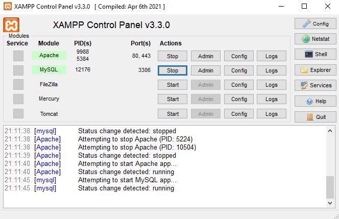
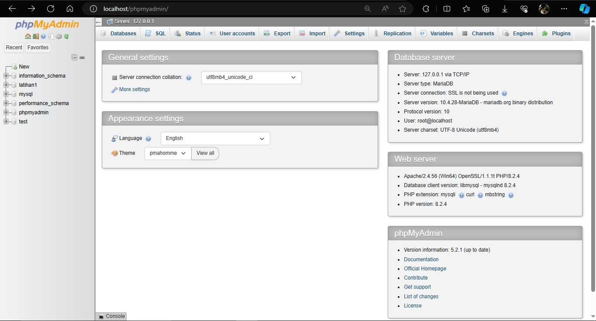
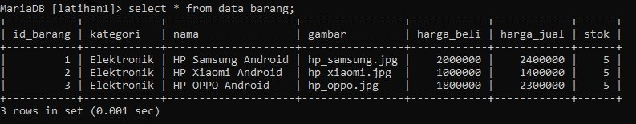
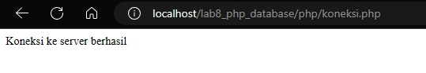
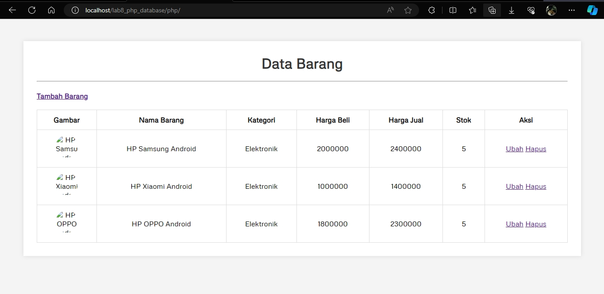
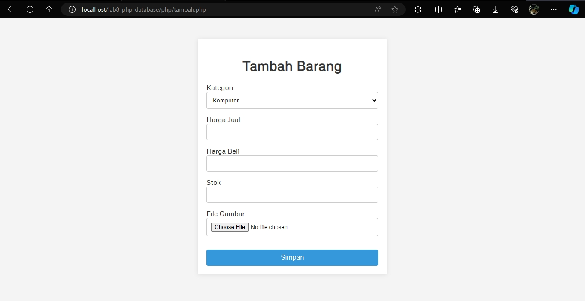
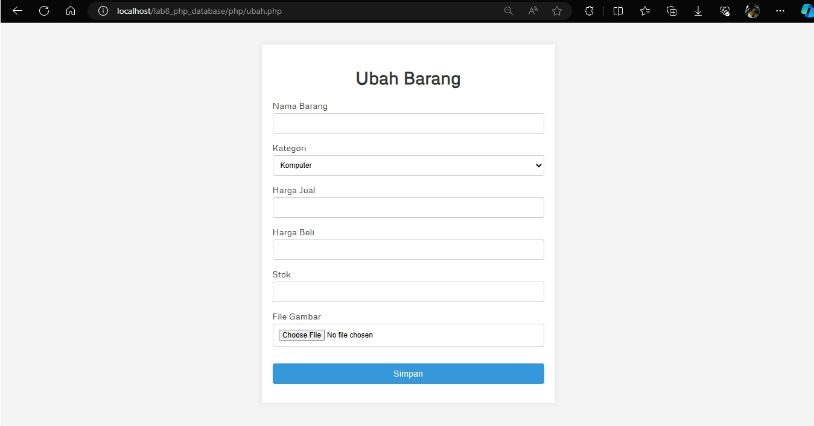

Nama : Rafif Isdarufa Athallah

NIM : 312210299

Kelas : TI.22.A3

---

## Pratikum 8: PHP dan Database MySQL

### Persiapan
Untuk memulai membuat aplikasi CRUD sederhana, yang perlu disiapkan adalah 
database server menggunakan MySQL. Pastikan MySQL Server sudah dapat dijalankan 
melalui XAMPP.

---

### Menjalankan MySQL Server
Untuk menjalankan MySQL Server dari menu XAMPP Control.



---

### Mengakses MySQL Client menggunakan PHP MyAdmin
Pastikan webserver Apache dan MySQL server sudah dijalankan. Kemudian buka 
melalui browser: http://localhost/phpmyadmin/



---

### Membuat Database

```sql
CREATE TABLE latihan1;
```

---

### Membuat Tabel

```sql
CREATE TABLE data_barang (
    id_barang int(10) auto_increment Primary Key,
    kategori varchar(30),
    nama varchar(30),
    gambar varchar(100),
    harga_beli decimal(10,0),
    harga_jual decimal(10,0),
    stok int(4)
);
```

---

### Menambahkan Data

```sql
INSERT INTO data_barang (kategori, nama, gambar, harga_beli, harga_jual, stok)
VALUES ('Elektronik', 'HP Samsung Android', 'hp_samsung.jpg', 2000000, 2400000, 5),
('Elektronik', 'HP Xiaomi Android', 'hp_xiaomi.jpg', 1000000, 1400000, 5),
('Elektronik', 'HP OPPO Android', 'hp_oppo.jpg', 1800000, 2300000, 5);
```



---

### Membuat Program CRUD
Buat folder lab8_php_database pada root directory web server (d:\xampp\htdocs). Kemudian untuk mengakses direktory tersebut pada web server dengan mengakses URL: http://localhost/lab8_php_database/

---

### Membuat File Koneksi Database

- Buat file baru dengan nama *koneksi.php*
- Deklarasi variabel yang menyimpan informasi tentang server database, pengguna, kata sandi, dan database yang akan dihubungkan. Variabel-variabel tersebut adalah: `$host`, `$user`, `$db`, `$pass`.
- Membuat koneksi ke database MySQL menggunakan fungsi mysqli_connect(). Fungsi ini menerima empat parameter.
- Jika koneksi berhasil, kode akan menampilkan pesan "Koneksi ke server berhasil". Jika koneksi gagal, kode akan menampilkan pesan "Koneksi ke server gagal" dan menghentikan eksekusi kode.

```php
<?php
$host = "localhost";
$user = "root";
$pass = "";
$db = "latihan1";

$conn = mysqli_connect($host, $user, $pass, $db);
if ($conn == false) {
    echo "Koneksi ke server gagal";
    die();
} else {
    echo "Koneksi ke server berhasil";
}
?>
```



---

### Menampilkan Data (Read)

- Buat file dengan nama *index.php*
- `include("koneksi.php) berfungsi untuk menghubungkan ke database menggunakan file *koneksi.php*. Bagian ini berisi kode untuk menghubungkan ke database dan menyimpan variabel koneksi dalam variabel `$conn`.
- Bagian kedua membuat permintaan data ke database menggunakan fungsi `mysqli_query()`. Fungsi ini menerima dua parameter: `$conn`, `$sql`. Dalam contoh ini, permintaan SQL adalah `SELECT * FROM data_barang` yang berarti mengambil semua data dari tabel `data_barang`.
- Mengolah hasil permintaan data menggunakan fungsi `mysqli_fetch_array()`. Fungsi ini mengambil baris berikutnya dari hasil permintaan data dan mengembalikannya sebagai array asosiatif. Fungsi `mysqli_fetch_array()` akan terus mengambil baris berikutnya hingga tidak ada lagi baris yang tersisa.

```php
<?php
include("koneksi.php");

// Query untuk menampilkan data
$sql = "SELECT * FROM data_barang";
$result = mysqli_query($conn, $sql);
?>
```

```html
<!DOCTYPE html>
<html lang="en">
<head>
    <meta charset="UTF-8">
    <link rel="stylesheet" href="style.css" type="text/css">
    <link rel="stylesheet" type="text/css" href="//fonts.googleapis.com/css?family=Metrophobic" />
    <title>Data Barang</title>
</head>
<body>
    <div class="container">
        <h1>Data Barang</h1><hr>
        <h4><a href="tambah.php">Tambah Barang</a></h4>
        <div class="main">
            <table>
                <tr>
                    <th>Gambar</th>
                    <th>Nama Barang</th>
                    <th>Kategori</th>
                    <th>Harga Beli</th>
                    <th>Harga Jual</th>
                    <th>Stok</th>
                    <th>Aksi</th>
                </tr>

                <?php if($result): ?>
                <?php while($row = mysqli_fetch_array($result)): ?>

                <tr>
                    <td>" alt="<?= $row['nama'];?>"></td>
                    <td><?= $row['nama'];?></td>
                    <td><?= $row['kategori'];?></td>
                    <td><?= $row['harga_beli'];?></td>
                    <td><?= $row['harga_jual'];?></td>
                    <td><?= $row['stok'];?></td>
                    <td>
                        <a href="ubah.php">Ubah</a>
                        <a href="hapus.php">Hapus</a>
                    </td>
                </tr>
                
                <?php endwhile; else: ?>
                <tr>
                    <td colspan="7">Belum ada data</td>
                </tr>
                <?php endif; ?>
            </table>
        </div>
    </div>
</body>
</html>
```



---

### Menambah Data (Create)

- Buat file dengan nama *tambah.php*
- `include_once("koneksi.php") berfungsi untuk menghubungkan ke database menggunakan file *koneksi.php*. File ini berisi kode untuk menghubungkan ke database dan menyimpan variabel koneksi dalam variabel `$conn`.
- `if (isset($_POST["NAMA])) {}` berfungsi untuk memeriksa data dari formulir yang dikirimkan oleh pengguna. Data yang diperiksa adalah nama, kategori, harga beli, harga jual, stok, dan gambar.
- `if ($file_gambar['error] == 0) {}` berfungsi untuk memproses upload gambar. Jika gambar berhasil diunggah, maka gambar akan disimpan di folder `gambar` dengan nama yang unik.
- `$sql = 'INSERT INTO...`, `$sql .= "VALUE..."` berfungsi untuk membuat permintaan SQL untuk menambahkan data baru ke database. Permintaan SQL ini berisi data yang telah diperiksa sebelumnya.
- `$result = mysqli_query()` berfungsi untuk meneruskan ke halaman index setelah data baru berhasil ditambahkan ke database.qqqq


```php
<?php
error_reporting(E_ALL);
include_once("koneksi.php");

if (isset($_POST["nama"])) {
    $nama = $_POST["nama"];
    $kategori = $_POST["kategori"];
    $harga_beli = $_POST["harga_beli"];
    $harga_jual = $_POST["harga_jual"];
    $stok = $_POST["stok"];
    $file_gambar = $_FILES["file_gambar"];
    $gambar = null;

    if ($file_gambar['error'] == 0) {
        $filename = str_replace(' ', '_', $file_gambar['name']);
        $destination = dirname(__FILE__) . '/gambar/' . $filename;

        if (move_uploaded_file($file_gambar['tmp_name'], $destination)) {
            $gambar = 'gambar/' . $filename;
        }
    }

    $sql = 'INSERT INTO data_barang (nama, kategori, harga_jual, harga_beli, 
        stok, gambar) ';
    $sql .= "VALUE ('{$nama}', '{$kategori}', '{$harga_jual}', '{$harga_beli}', '{$stok}', '{$gambar}')";
    $result = mysqli_query($conn, $sql);
    header("location: index.php");
}
?>
```

```html
<!DOCTYPE html>
<html lang="en">
<head>
    <meta charset="UTF-8">
    <link rel="stylesheet" type="text/css" href="//fonts.googleapis.com/css?family=Metrophobic" />
    <title>Tambah Barang</title>
    <style>
        body {
            font-family: 'Metrophobic', sans-serif;
            background-color: #f4f4f4;
            margin: 0;
            padding: 0;
        }

        .container {
            max-width: 400px;
            margin: 50px auto;
            background-color: #fff;
            padding: 20px;
            box-shadow: 0 0 10px rgba(0, 0, 0, 0.1);
        }

        h1 {
            text-align: center;
            color: #333;
        }

        form {
            display: flex;
            flex-direction: column;
        }

        .input {
            margin-bottom: 15px;
        }

        label {
            margin-bottom: 5px;
            color: #333;
        }

        select,
        input[type="text"],
        input[type="file"] {
            width: 100%;
            padding: 10px;
            border: 1px solid #ccc;
            border-radius: 4px;
            box-sizing: border-box;
            font-family: "Metrophobic", sans-serif;
        }

        select {
            cursor: pointer;
        }

        .submit {
            text-align: center;
        }

        input[type="submit"] {
            background-color: #3498db;
            color: #fff;
            width: 100%;
            margin-top: 16px;
            padding: 10px 16px;
            border: none;
            border-radius: 4px;
            cursor: pointer;
            font-size: 16px;
        }

        input[type="submit"]:hover {
            background-color: #2980b9;
        }
    </style>
</head>
<body>
    <div class="container">
        <h1>Tambah Barang</h1>
        <div class="main">
            <form method="POST" action="tambah.php" enctype="multipart/form-data">
                <div class="input">
                    <label>Kategori</label>
                    <select name="kategori">
                        <option value="Komputer">Komputer</option>
                        <option value="Elektronik">Elektronik</option>
                        <option value="Handphone">Handphone</option>
                    </select>
                </div>
                <div class="input">
                    <label>Harga Jual</label>
                    <input type="text" name="harga_jual">
                </div>
                <div class="input">
                    <label>Harga Beli</label>
                    <input type="text" name="harga_beli">
                </div>
                <div class="input">
                    <label>Stok</label>
                    <input type="text" name="stok">
                </div>
                <div class="input">
                    <label>File Gambar</label>
                    <input type="file" name="file_gambar">
                </div>
                <div class="submit">
                    <input type="submit" name="submit" value="Simpan">
                </div>
            </form>
        </div>
    </div>
</body>
</html>
```



---

### Mengubah Data (Update)

Buat file dengan nama *ubah.php*

```php
<?php
error_reporting(E_ALL);
include_once("koneksi.php");

if (isset($_POST["submit"])) {
    $id = $_POST["id"];
    $nama = $_POST["nama"];
    $kategori = $_POST["kategori"];
    $harga_beli = $_POST["harga_beli"];
    $harga_jual = $_POST["harga_jual"];
    $stok = $_POST["stok"];
    $file_gambar = $_FILES["file_gambar"];
    $gambar = null;

    if ($file_gambar['error'] == 0) {
        $filename = str_replace(' ', '_', $file_gambar['name']);
        $destination = dirname(__FILE__) . '/gambar/' . $filename;

        if (move_uploaded_file($file_gambar['tmp_name'], $destination)) {
            $gambar = 'gambar/' . $filename;
        }
    }

    $sql = 'UPDATE data_barang SET';
    $sql .= "nama = '{$nama}', kategori = '{$kategori}', ";
    $sql .= "harga_jual = '{$harga_jual}', harga_beli = '{$harga_beli}', stok = '{$stok}' ";

    if (!empty($gambar)) {
        $sql .= ", gambar = '{$gambar}' ";
        $sql .= "WHERE id_barang = '{$id}'";
        $result = mysqli_query($conn, $sql);

        header('location: index.php');
    }
}

$id = $_GET['id'];
$sql = "SELECT * FROM data_barang WHERE id_barang = '{$id}'";
$result = mysqli_query($conn, $sql);

if (!$result) {
    die('Error: Data tidak tersedia');
}

$data = mysqli_fetch_array($result);

function is_select($var, $val)
{
    if ($var == $val) {
        return 'selected = "selected"';
    }
    return false;
}
?>
```

```html
<!DOCTYPE html>
<html lang="en">
<head>
    <meta charset="UTF-8">
    <link rel="stylesheet" type="text/css" href="//fonts.googleapis.com/css?family=Metrophobic" />
    <title>Ubah Barang</title>
    <style>
        body {
            font-family: 'Metrophobic', sans-serif;
            background-color: #f4f4f4;
            margin: 0;
            padding: 0;
        }

        .container {
            max-width: 500px;
            margin: 50px auto;
            background-color: #fff;
            padding: 20px;
            box-shadow: 0 0 10px rgba(0, 0, 0, 0.1);
        }

        h1 {
            text-align: center;
            color: #333;
        }

        .input {
            margin-bottom: 15px;
        }

        label {
            display: block;
            margin-bottom: 5px;
            color: #333;
        }

        input,
        select {
            width: 100%;
            padding: 10px;
            box-sizing: border-box;
            border: 1px solid #ccc;
            border-radius: 4px;
        }

        .submit {
            text-align: center;
        }

        input[type="submit"] {
            background-color: #3498db;
            color: #fff;
            margin-top: 16px;
            padding: 10px 15px;
            border: none;
            border-radius: 4px;
            cursor: pointer;
            font-size: 16px;
        }

        input[type="submit"]:hover {
            background-color: #267bb5;
        }
    </style>
</head>
<body>
    <div class="container">
        <h1>Ubah Barang</h1>
        <div class="main">
            <form method="POST" action="ubah.php" enctype="multipart/form-data">
                <div class="input">
                    <label>Nama Barang</label>
                    <input type="text" name="nama" value="<?php echo $data['nama']; ?>">
                </div>
                <div class="input">
                    <label>Kategori</label>
                    <select name="kategori">
                        <option <?php echo is_select('Komputer', $data['kategori']); ?> value="Komputer">Komputer
                        </option>
                        <option <?php echo is_select('Elektronik', $data['kategori']); ?> value="Elektronik">Elektronik
                        </option>
                        <option <?php echo is_select('Handphone', $data['kategori']); ?> value="Handphone">Handphone
                        </option>
                    </select>
                </div>
                <div class="input">
                    <label>Harga Jual</label>
                    <input type="text" name="harga_jual" value="<?php echo $data['harga_jual']; ?>">
                </div>
                <div class="input">
                    <label>Harga Beli</label>
                    <input type="text" name="harga_beli" value="<?php echo $data['harga_beli']; ?>">
                </div>
                <div class="input">
                    <label>Stok</label>
                    <input type="text" name="stok" value="<?php echo $data['stok']; ?>">
                </div>
                <div class="input">
                    <label>File Gambar</label>
                    <input type="file" name="file_gambar">
                </div>
                <div class="submit">
                    <input type="hidden" name="id" value="<?php echo $data['id_barang']; ?>">
                    <input type="submit" name="submit" value="Simpan">
                </div>
            </form>
        </div>
    </div>
</body>
</html>
```



---

### Menghapus Data (Delete)

Buat file dengan nama *hapus.php*

```php
<?php
include_once 'koneksi.php';
$id = $_GET['id'];
$sql = "DELETE FROM data_barang WHERE id_barang = '{$id}'";
$result = mysqli_query($conn, $sql);
header('location: index.php');
?>
```

